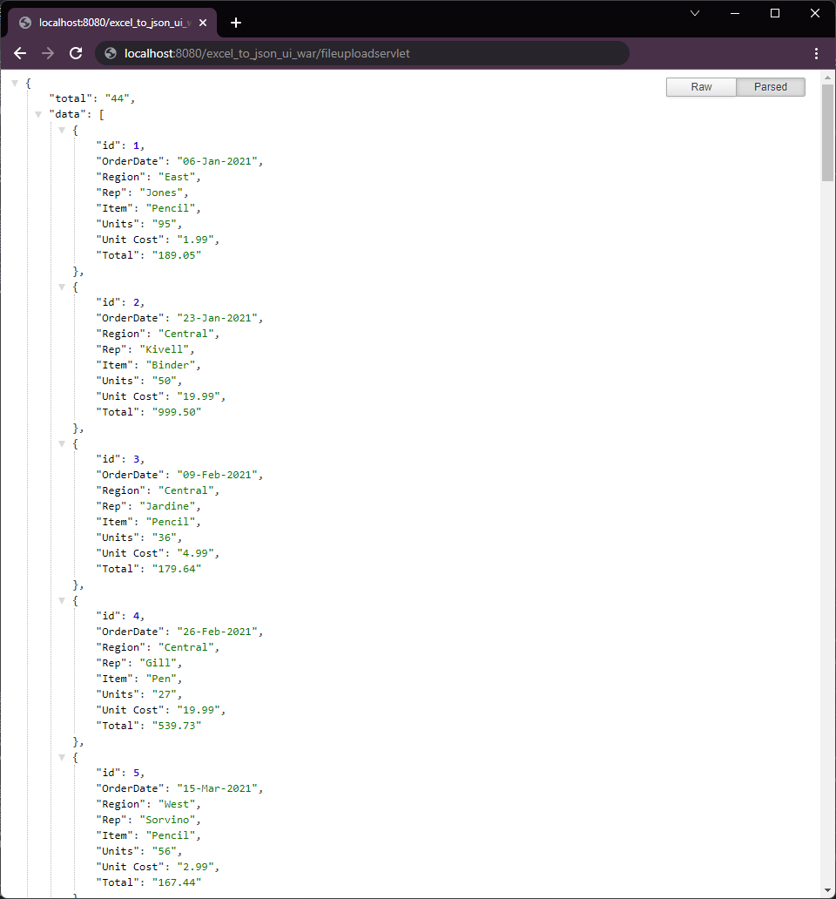

# excel-to-json

# Excel to Json App

[](https://github.com/tterb/atomic-design-ui/blob/master/LICENSEs)
[](https://mvnrepository.com/artifact/com.google.code.gson/gson/2.8.8)
[](https://mvnrepository.com/artifact/org.apache.poi/poi/5.2.0)


This is a simple web application where you can upload a single sheet MS Excel file and then get it converted to JSON data.


## Run Locally

Clone the project

```bash
  git clone https://github.com/rahul-ojha-07/excel-to-json.git
```

Go to the project directory

```bash
  cd excel-to-json
```

Install dependencies/ Build Project

```bash
  mvn clean install
```

Start the App

```bash
  use tomact or any server runtime to run the app
```
`Note: you may need to create a Temp folder in your server runtime's directory`


## Screenshots

<p align="center">
  
  <br>
  
</p>


## Tech Stack

**Development:** [Java](https://www.java.com/en/), [Maven](https://maven.apache.org/),  [Apache POI](https://poi.apache.org/), [GSON](https://github.com/google/gson)

**Hosting/Deployment:** [Apache Tomcat](https://tomcat.apache.org/)

